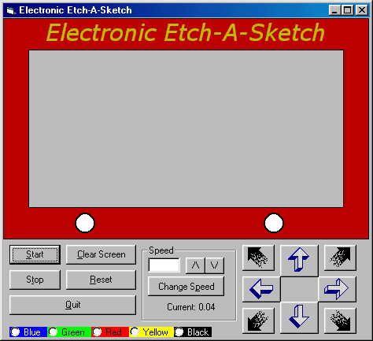



## Electronic Etch\-A\-Sketch

### Description

It's basically just like an etch-a-sketch, but on your computer! No purpose, but it's just fun.
 
### More Info
 
Hard to describe, you're better of just viewing the form.

             |
---                |---
**Submitted On**   |2000-04-18 18:31:38
**By**             |[Daniel Chiti](https://github.com/Planet-Source-Code/PSCIndex/blob/master/ByAuthor/daniel-chiti.md)
**Level**          |Beginner
**User Rating**    |5.0 (10 globes from 2 users)
**Compatibility**  |VB 5\.0, VB 6\.0
**Category**       |[Games](https://github.com/Planet-Source-Code/PSCIndex/blob/master/ByCategory/games__1-38.md)
**World**          |[Visual Basic](https://github.com/Planet-Source-Code/PSCIndex/blob/master/ByWorld/visual-basic.md)
**Archive File**   |[CODE\_UPLOAD49424182000\.zip](https://github.com/Planet-Source-Code/daniel-chiti-electronic-etch-a-sketch__1-7380/archive/master.zip)

